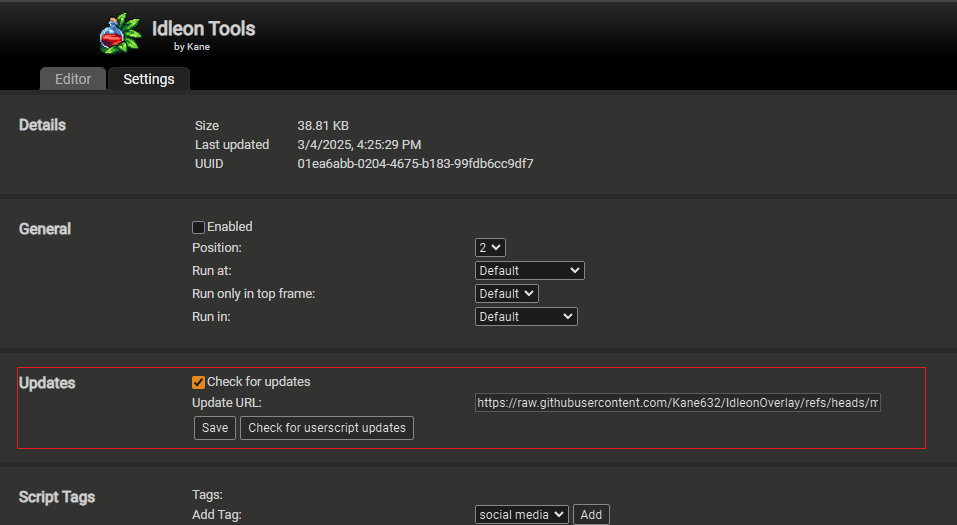

# TampermonkeyScripts

This repository contains a collection of Tampermonkey scripts.

# Table of contents
1. [IdleonTools](#idleon-tools)
    1. [Installation](#idleon-tools-installation)
    2. [Auto Updates](#idleon-tools-updates)
    3. [How to use](#idleon-tools-how-to-use)
        1. [Copy cursor in window coordinates](#idleon-tools-mouse-coordinates)
    4. [Develop locally](#idleon-tools-develop)

## IdleonTools.js  <a name="idleon-tools"></a>
This script is intended to be used in the [Idleon](https://www.legendsofidleon.com/) game.  

The IdleonTools.js script when enabled will add some kind of automation on top of the browser game.  

### Installation  <a name="idleon-tools-installation"></a>
Go to the Tampermonkey extension dashboard. Then inside the Utilities tab import the script with the following url:  
  
https://raw.githubusercontent.com/Kane632/IdleonOverlay/refs/heads/main/IdleonTools.js  

  

### Auto Updates  <a name="idleon-tools-updates"></a>
Inside the script settings check that the url has been automatically set when imported. If not, set it here.  

  

### How to use  <a name="idleon-tools-how-to-use"></a>
When opening the game inside your browser while the script is enabled will inject some code to the webpage.  

The first change is that you will now have a small greyish square on the game top left corner like so:
  

When hovering over it with your mouse it will open this overlay and the script automations will be shown.

  

To exit this overlay just drag the mouse out of press the ESC key on your keboard.  

#### Copy cursor in window coordinates  <a name="idleon-tools-mouse-coordinates"></a>
Put your mouse anywhere on the game screen and press the HOME key. You can now check your current mouse coordinates in the console output.  

  

### Develop locally  <a name="idleon-tools-develop"></a>  
Create a new Tampermonkey script and paste the following:  

```
// ==UserScript==
// @name         Idleon Tools Visual Studio
// @namespace    http://tampermonkey.net/
// @version      0.1
// @description  try to take over the world!
// @author       You
// @match        https://www.legendsofidleon.com/ytGl5oc/
// @icon         https://www.google.com/s2/favicons?sz=64&domain=legendsofidleon.com
// @require      file://D:\_Dev\tampermonkeyscripts\IdleonTools.js
// @grant        none
// ==/UserScript==
```
Remember to replace the @require field filepath with your IdleonTools.js path. Then you can disable the previous script and leave the new one enabled like so:  

  

Remember that after each script modification you need to save the script and then reload the webpage so that Tampermonkey reinjects the script with the new changes.